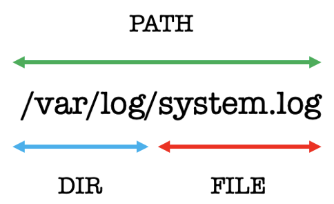

# getmeta

### Installation

```
curl https://sh.rustup.rs -sSf | sh -s -- -y
source "$HOME/.cargo/env"
```

### Development

```
cargo build
cargo run
```

### Artifacts

- amiid
- fpath
- fname
- fsize
- b3hash
- b3name
- b3path
- b3dir

### Test

- File paths containing the pipe **|** character are skipped!

### Classifications

- **DENIED** Permission Issue
- **EMPTY** Empty File Hash
- **LARGE** File Size 100+ MB
- **ZERO** Zero File Size

### Requirements

```
yum install gcc git openssl-devel -y
```

### Binary Build

```
cargo build --release
```

